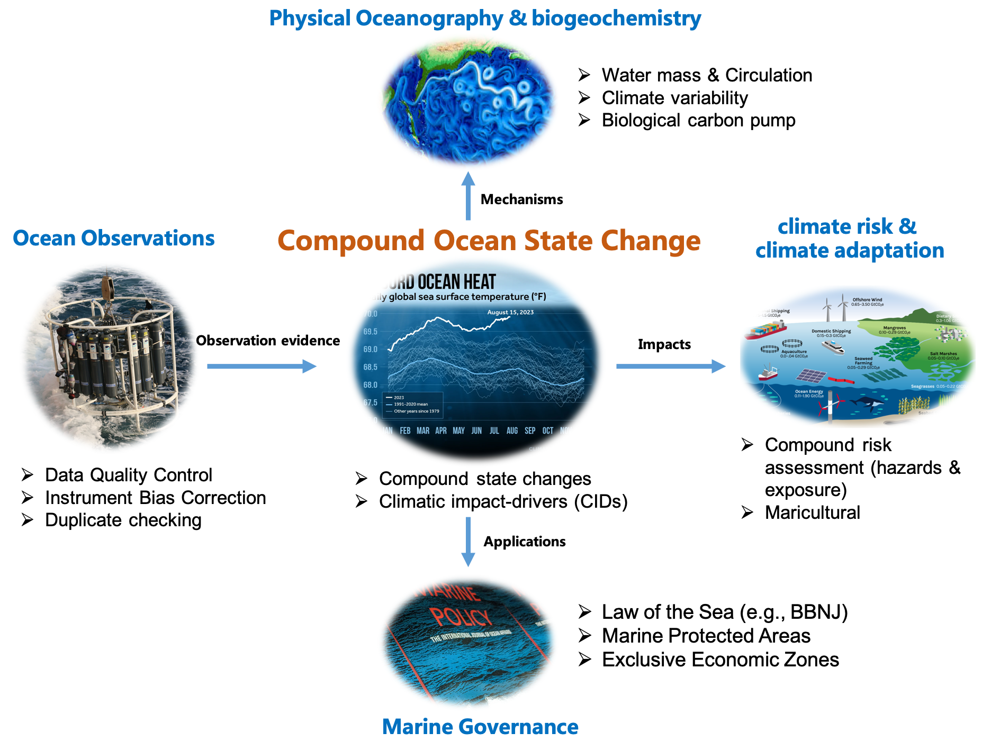

# !! Nov 2025: Updates and Dataset Information of a recent publication titled 'Observed large-scale and deep-reaching compound ocean state changes over the past 60 years' in *Nature Climate Change* (Tan et al., 2025) !! 🐋🐋

**🔗** Tan, Z., K. v. Schuckmann, S. Speich, L. Bopp, J. Zhu, and L. Cheng. (2025): Observed large-scale and deep-reaching compound ocean state changes over the past 60 years. Nature Climate Change. [https://www.nature.com/articles/s41558-025-02484-x](https://www.nature.com/articles/s41558-025-02484-x)

📚 **Summary**: This paper uses time-of-emergence (ToE) to highlight **the increases in impacts of individual and compound changes globally from the surface to the deeper ocean, identifying areas most affected.**

📕 **PDF**: This paper could be downloaded [here](../files/2025-Tan-Compound-NCC.pdf).

🎥 **Dashboard**: A dashboard is available [here](http://www.ocean.iap.ac.cn/pages/dataV/dataV.html?navAnchor=dataV) to **enable the climate scientists and climate policy-makers** to check the dynamic evolution (since 1985) and current state of the simultaneous change in the global ocean.

📊 **Dataset**: The **IAP Compound climatic impact-drivers (CIDs) monitoring dataset** (version 0.1) can be accessed [here](http://www.ocean.iap.ac.cn/ftp/cheng/Compound_CIDs/). This dataset provides the time of emergence (ToE) for individual CIDs (temperature, salinity, dissolved oxygen, and surface pH) and their compound changes estimation **from 1980 to 2023 at 1-degree box from 0-1000m in the global ocean**. A backup link to download this dataset is [here](../files/IAP_Compound_CID_dataset_v0.1.zip).

▶️ **Video**: an evolution of the **changing compound CIDs (ToE and its exposure) from 1980 to 2023** can be reached [here](http://www.ocean.iap.ac.cn/ftp/cheng/Compound_CIDs/dynamic_video/) 

🐍 **Codes**: The codes to reproduce the key figures (Figure 2 and Figure 3 of Tan et al., 2025) can be accessed via the [IAP ocean's team website](http://www.ocean.iap.ac.cn/ftp/cheng/Compound_CIDs/script_demo/).

🐍 **Codes**: Demo codes of **the calculation of time-of-emergence (ToE)** using the temperature gridded product can be reached in the [GitHub repository](https://github.com/zqtzt/Compound_ocean_climate_change/tree/main/demo_individual_ToE). 

♻️ The [GitHub repository](https://github.com/zqtzt/Compound_ocean_climate_change) also provides more information on the datasets, codes, and demos of the IAP Compound CIDs monitoring dataset. All future updates will be upload to my [GitHub repository](https://github.com/zqtzt/Compound_ocean_climate_change) and [IAP ocean's team website](http://www.ocean.iap.ac.cn/ftp/cheng/Compound_CIDs/script_demo/). 

📄 **News/Press/Reports**:

​	📎 [EurekAlert](https://www.eurekalert.org/news-releases/1107068#:~:text=A%20promising%20international%20study%20published,pushing%20marine%20environments%20into%20uncharted)

# About Me 🐋

I am a Ph.D. specializing in Physical Oceanography, Operational Oceanography, and ocean climate change impact, with a particular focus on **ocean observations and data quality improvements, water mass and ocean circulation, ocean compound climate change, ocean warming monitoring, and compound risk assessment**. I hold my Ph.D from the Institute of Atmospheric Physics, Chinese Academy of Sciences (Supervisors: Prof. [CHENG Lijing](https://scholar.google.com/citations?user=XzerSxgAAAAJ&hl=en&oi=ao) and [Prof. ZHU Jiang](http://www.ocean.iap.ac.cn)) in July 2024. 

Currently, I am a post-doc investigator at Department of Geosciences (Laboratoire de Météorologie Dynamique), École Normale Supérieure (ENS), Université Paris Sciences et Lettres (PSL) since Feb 2025 (Advisors: Prof. [Sabrina Speich](https://scholar.google.com/citations?user=G0VWQsEAAAAJ&hl=en&oi=ao) and Prof. [Elaine McDonagh](https://scholar.google.com/citations?hl=en&user=MOA44_QAAAAJ&view_op=list_works&citft=1&email_for_op=tanzhetao19%40gmail.com&gmla=ANZ5fUMCfnT0QzegPfpwdSM8RTwmvgcly_vn8BGejH4rmU1Of-MumLFms-ETRhY1xK-ipXE4bAujtWHrnT0gHGX6x-TkNZ7TUvFCiLFUEWAQOK4MSt1sXRkUJ6zLnyMonkEvMv5ipIXvz7IwgQpC9FC-LUb8V0sQIJKnSLeJp8f4zcAxA7nGa3lv36445VhggyYrwLcJ3oDXHybZk9I6EU8X2xpDSXZFkpWaWQuR6K_9nQ1p)), working for Ice sheet impacts on global ocean circulation (WP5) of the OCEAN:ICE project funded by Horizon Europe.

The figure below shows my research interests, encompassing operational oceanography, physical oceanography, and climate adaptation. Particularly, **I mainly focused on the study of ‘climate impact-drivers’ (e.g., temperature, salinity, dissolved oxygen, pH, etc.) which connect physical ocean changes to broader climate impacts and marine governance (MPAs, BBNJ etc.).** I constructed and utilized several ocean *in-situ* observational data products to identify the climate ‘hot spot’ regions mostly affected by the compound climate changes and developed frameworks and tools to assess these impacts in different ocean sectors and ocean domains (e.g., High Seas and EEZs). I also investigated the freshwater and oxygen budget of the South Atlantic Ocean, focusing on the regional redistribution processes and their link to AMOC under climate change.

Besides, **I am the member of International Quality Controlled Ocean Database (IQuOD).** I specialize in ocean data processing and analysis, significantly improving the quality of ocean observational data. These efforts included: 1) development of advanced data quality systems by creating open-source tools in the ocean science community for data validation and quality control (e.g., XBT bias correction schemes, data QC system, data duplicate checking etc.). 2) Innovative data analysis techniques such as employed statistical methods to analyze climate data trends and variations (detection & attribution etc.).

# Research Interests 

You can find my CV [here](./files/Zhetao-CV-English.pdf)

中文简历可以在[这里](./files/谭哲韬-学术中文简历.pdf)获取

# !! News in Tan et al., 2025, *Scientific Data* !! 🐋🐋

### The global in-situ salinity profiles dataset since 1940s was published in *Scientific Data* and <u>is now freely available</u>

📎 **Dataset**: This salinity dataset (namely CODC-S) can be freely downloaded via http://www.ocean.iap.ac.cn/ftp/cheng/CODCv2.1_Insitu_T_S_database/ or https://doi.org/10.12157/IOCAS.20241217.001

🗂️ The second version (v2.1) of the CODC Global Ocean Temperature and Salinity Profile Science Database (CAS- Oceanographic Data Center, Global Ocean Science Database: CODC-v2) was led by the Institute of Atmospheric Physics, Chinese Academy of Sciences, a co-founding institution of the Oceanographic Science Data Center, Chinese Academy of Sciences, in collaboration with the Institute of Oceanology, Chinese Academy of Sciences, the Computer Network Information Center, Chinese Academy of Sciences, and other organizations. The database provides ocean temperature and salinity profile data that have been quality-controlled and bias-corrected. The database covers observational data from 1940 onwards, sourced from 14 types of observation instruments, including XBT, CTD, Argo, gliders, and buoys. It contains 18,472,149 temperature profiles and **11,273,326 salinity profiles** (statistics from January 1940 to November 2024). These salinity profiles are quality-controlled (QC-ed) using **a new automated salinity quality control system named CODC-QC-S** (the CODC Quality Control system – Salinity component), consisting of 11 distinct quality checks.

📈 For efficiently reuse in the community, we also put the CODC temperature (CODC-T) profiles (Zhang et al., 2024) together in the same folder.

🧾I am responsible to maintain and update this dataset. For any question, please do not hesitate to tell me.

**📚 Citation:** **<u>Tan Z</u>**, Zhu Y, Cheng L, Gouretski V, Pan Y, Yuan H, Wang Z, Li G, Song X, Zhang B, Bao S, Li Y, Zhu J. 2025. CODC-S: A quality-controlled global ocean salinity profiles dataset. Scientific Data, 12: 917. https://doi.org/10.1038/s41597-025-05172-9

Contact Information
------
✉️ [zhetao.tan@lmd.ipsl.fr](zhetao.tan@lmd.ipsl.fr)  or [tanzhetao19@mails.ucas.ac.cn](tanzhetao19@mails.ucas.ac.cn)

Tel: (+33) 699130934 ; (+86) 13413812907
